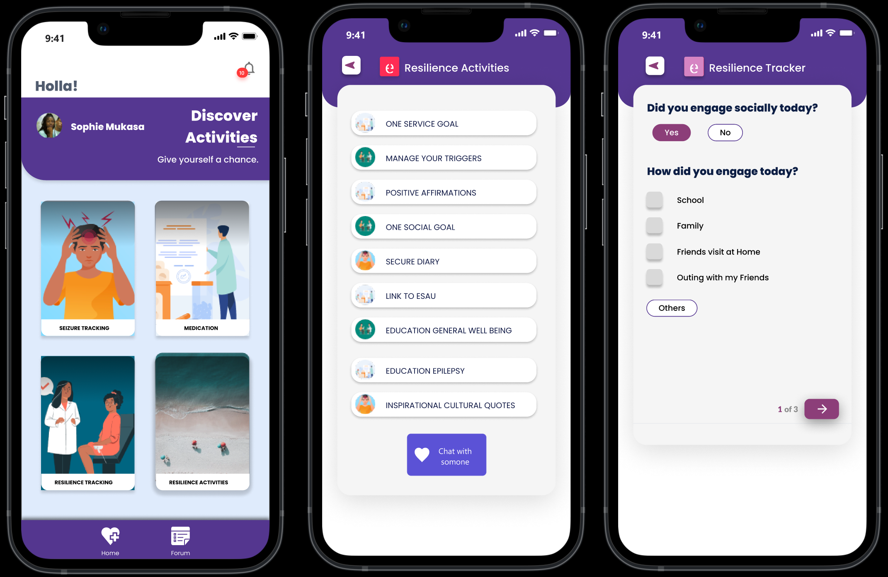

# Epilepsy Self Management and Resilience Techinical(SMART) App

This repo contains source code for the Epilepsy SMART App (<https://smartapp.aceuganda.org>)



## Running the development server
### Prerequisites
1. Download and install [Git](https://git-scm.com/downloads)

    This will be used to download the repository

2. Download and install [Node.js](https://nodejs.org/en/download/) version 16 +

    This is the programming language required to run the project

## Getting Started
- Clone the and switch to repo directory


    ```cd epilepsy-smart-app```

- Installing dependencies:

    ```npm install```

- Running the development server:

    ```npm start```

## Building the app for production
- To build the app for production, run the following command:

    ```npm run build```

- To build the app for android & IOS, run the following commands:


    ```npm run app:build```

    This will generate a production build which will later be converted to a native app using CapacitorJS

## Running the app on a device
- To run the app on a device, run the following command:

    ```npx cap open <platform>```

    You can specify the platform as either android or ios. This will open the native project in Android Studio or Xcode respectively.

## Links and Resources
- [ReactJS](https://reactjs.org/)
- [Redux](https://redux.js.org/)
- [CapacitorJS](https://capacitorjs.com/)
  
