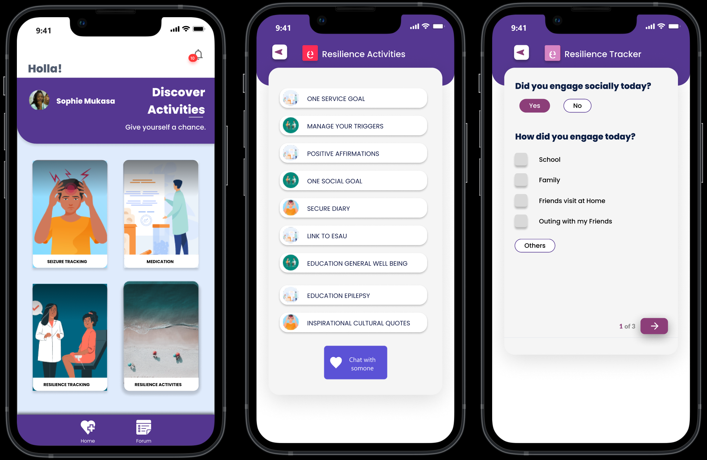

# Epilepsy Self Management and Resilience Techinical(SMART) App

This repo contains source code for the Epilepsy SMART App (<https://smartapp.aceuganda.org>)



## Running the development server
### Prerequisites
1. Download and install [Git](https://git-scm.com/downloads)

    This will be used to download the repository

2. Download and install [Node.js](https://nodejs.org/en/download/) version 24

    This is the programming language required to run the project

## Getting Started
- Clone the and switch to repo directory


    ```cd epilepsy-smart-app```

- Use the project Node version:

    ```nvm use```

- Installing dependencies:

    ```yarn install```

- Running the development server:

    ```yarn start```

## Building the app for production
- To build the app for production, run the following command:

    ```yarn build```

- To build the app for android & IOS, run the following commands:


    ```yarn app:build```

    This generates a production web build in `build/` and syncs it into the native Capacitor projects.

## Android build commands
- Build and sync Android assets:

    ```yarn android:sync```

- Open the Android project in Android Studio:

    ```yarn android:studio```

- Build a debug APK from the command line:

    ```yarn android:apk```

    The APK is generated at `android/app/build/outputs/apk/debug/app-debug.apk`.

- Build a release APK from the command line:

    ```yarn android:release```

    The APK is generated at `android/app/build/outputs/apk/release/app-release.apk` if Android signing is configured.

## Running the app on a device
- To run the app on a device, run the following command:

    ```npx cap open <platform>```

    You can specify the platform as either android or ios. This will open the native project in Android Studio or Xcode respectively.

## Links and Resources
- [ReactJS](https://reactjs.org/)
- [Redux](https://redux.js.org/)
- [CapacitorJS](https://capacitorjs.com/)
  
